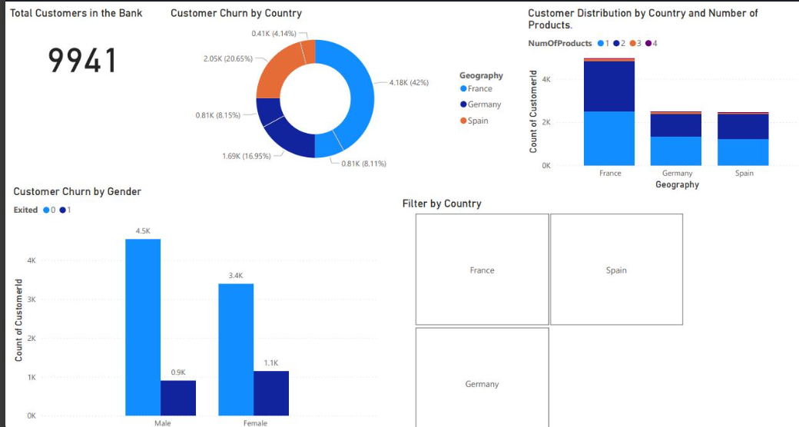

# Customer Churn & Distribution Analysis Dashboard

A Power BI dashboard analysing customer churn patterns across 9,941 bank customers, exploring churn by country, gender, and product distribution to identify engagement and retention trends.

> **Note:** The original `.pbix` file is no longer available. This repo showcases the dashboard through a screenshot, along with a summary of the approach and key insights.



---

## Project Objective

To analyse customer churn behaviour within a retail banking dataset, identifying which customer segments (by country, gender, and product holding) show higher churn rates — supporting data-driven retention strategy decisions.

---

## Data Source

Publicly available bank customer churn dataset (Kaggle).

---

## Tools & Skills Used

| Stage | Tools |
|---|---|
| Data cleaning & transformation | Power Query |
| Data modelling | Power BI |
| Calculated metrics | DAX (KPI cards, churn breakdowns) |
| Dashboard development | Power BI Desktop |
| Interactivity | Country filter/slicer (France, Germany, Spain) |

---

## Dashboard Overview

- **Total Customers:** 9,941
- **Customer Churn by Country:** Churn distribution shown across France, Germany, and Spain, split by exited status
- **Customer Churn by Gender:** Male customers — 4.5K retained vs 0.9K churned; Female customers — 3.4K retained vs 1.1K churned
- **Customer Distribution by Country & Number of Products:** Product holding (1–4 products) broken down by geography, with France holding the largest customer base
- **Interactive Filter:** Country-level filter (France, Germany, Spain) for drill-down analysis

---

## Key Insights

- France accounts for the largest share of the customer base and the highest churn volume, though this partly reflects its larger overall population in the dataset
- Female customers show a notably higher churn rate proportionally (~24%) compared to male customers (~17%), despite a smaller total customer base
- Product holding is concentrated around 1–2 products per customer across all three countries, with minimal 3–4 product uptake
- Churn is not evenly distributed by geography, suggesting country-specific retention strategies may be more effective than a uniform approach

---

## Repo Contents

\```
├── README.md
│   └── customer-churn-dashboard.png
\```

---

## About

Independent Power BI project — part of a self-directed portfolio built to strengthen data analytics and dashboard design skills. Completed **July–September 2025**.
